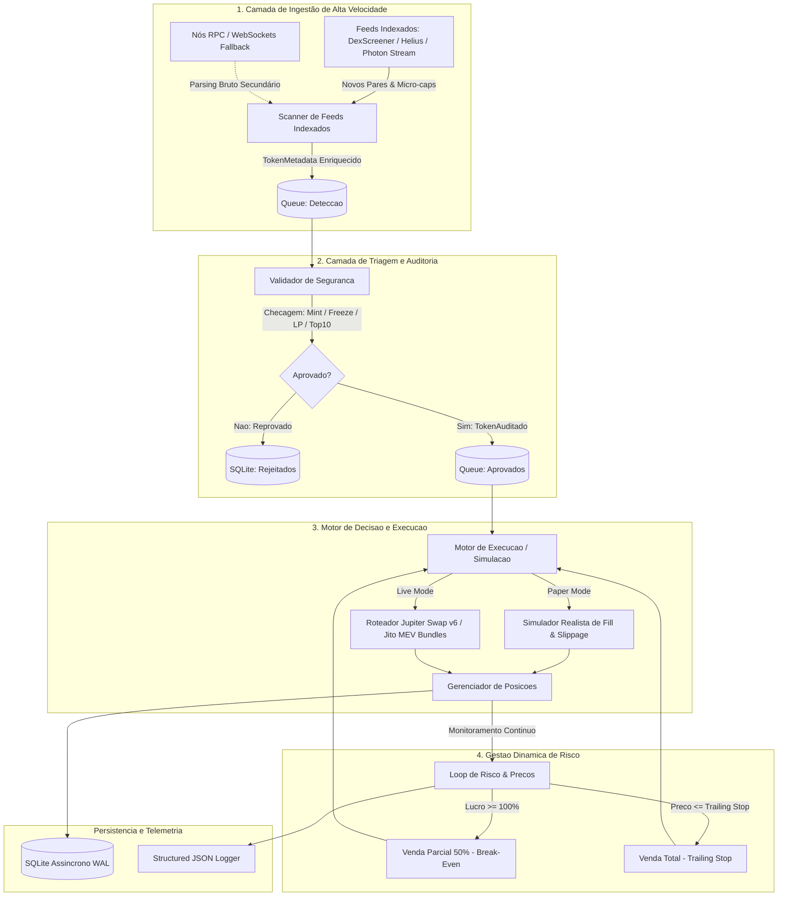

# ARCHITECTURE.md — Arquitetura do Sistema e Fluxos

> **Sistema**: Vertex-bot  
> **Propósito**: Bot de alta performance para varredura on-chain, validação de segurança, simulação e execução em DEXes.  
> **Filosofia Arquitetural**: Desacoplamento modular orientado a eventos, concorrência assíncrona não-bloqueante e isolamento rigoroso de falhas.

---

## 1. Visão Geral do Sistema

O **Vertex-bot** opera em um pipeline contínuo e assíncrono projetado para processar centenas de eventos por segundo em redes descentralizadas. O sistema separa estritamente a detecção de ativos, a análise de segurança, a decisão financeira e a execução de ordens.



---

## 2. Módulos do Sistema e Responsabilidades

O sistema é dividido em 4 módulos centrais independentes que comunicam-se exclusivamente através de filas assíncronas (`asyncio.Queue`) ou eventos de barramento:

### 2.1. Scanner On-Chain e Ingestão Indexada (`vertex.scanner`)
- **Responsabilidade**: Detecção ultrarrápida de novos pares e micro-caps recém-listadas em DEXes (Raydium e Pump.fun).
- **Abordagem Híbrida (Photon-Aligned)**:
  - **Provedor Primário (Feeds Indexados)**: Consome fluxos estruturados de alta velocidade (estilo Photon / DexScreener / Helius), recebendo metadados ricos no momento zero (preço inicial em USD, liquidez real, pool address, base/quote mint) sem a necessidade de manter nós RPC dedicados caros.
  - **Provedor Secundário (Fallback RPC/WebSocket)**: Escuta de logs brutos de instrução de programas (`initialize2` e `create`) para redundância.
- **Saída**: Produz objetos `TokenMetadata` enriquecidos diretamente para a fila de triagem.
- **Isolamento**: Falhas transitórias no feed disparam comutação automática sem impactar o gerenciamento das posições ativas.

### 2.2. Validador de Segurança (`vertex.security`)
- **Responsabilidade**: Execução sequencial e paralela de verificações criptográficas e contratuais antes que qualquer ordem seja cogitada.
- **Filtros de Hard Gate**:
  - Verificação de autoridades de controle (Mint Authority revogada, Freeze Authority revogada).
  - Análise da Liquidez Inicial: Queima (Burn 100%) ou bloqueio contratual de LP comprovado.
  - Distribuição de fornecimento: Análise do top 10/20 holders (exclusão de pools oficiais).
  - Honeypot / Tax Simulation: Simulação local de transação de compra e venda para validar impostos e rejeitar blacklists.
- **Saída**: Tokens reprovados são persistidos com justificativa para auditoria (`REJECTED`). Tokens válidos seguem para o motor de execução.

### 2.3. Motor de Simulação e Execução (`vertex.execution`)
- **Responsabilidade**: Abstração agnóstica entre o ambiente de teste e o ambiente real.
- **Modos de Operação**:
  - `PAPER_TRADING` (Homologação / Simulação):
    - Executa ordens virtuais baseando-se no estado real do pool de liquidez.
    - Aplica latência simulada (ex: 250ms - 500ms) e modelo matemático de impacto de preço/slippage.
    - Calcula taxas estimadas (gas fee / priority fee) debitadas de uma carteira virtual.
  - `LIVE_TRADING`:
    - Constrói, assina e transmite transações serializadas via nós RPC de alta performance.
    - Confirmação via subscrição de status de transação (commitment level configurável).
- **Garantias**: Idempotência de transações; nenhuma ordem pode ser disparada duas vezes para a mesma posição.

### 2.4. Gestor de Risco e Ciclo de Posição (`vertex.risk`)
- **Responsabilidade**: Máquina de estados responsável pelas posições ativas desde o preenchimento da compra até o encerramento total.
- **Sub-rotinas**:
  - **Price Poller**: Atualização assíncrona do preço de cada posição ativa com taxa de amostragem configurável (ex: a cada 500ms a 2s).
  - **Estratégia de Break-Even**: Ao atingir alvo de +100% (2x do valor de entrada), dispara automaticamente ordem de venda a mercado de 50% dos tokens, recuperando 100% do capital inicial.
  - **Trailing Stop Contínuo**: Acompanhamento do `highest_price_seen`. Se o preço recuar uma porcentagem pré-definida a partir da máxima (ex: -12%), o restante da posição é liquidado imediatamente.

---

## 3. Modelo de Concorrência e Assincronia

O **Vertex-bot** utiliza o loop de eventos assíncrono nativo do Python (`asyncio`) baseado em tarefas cooperativas (`asyncio.TaskGroup` ou tarefas supervisionadas).

### 3.1. Estratégia de Filas e Concorrência
```
[Scanner Task] --------> [scanner_to_security_queue (maxsize=1000)]
                                   │
                                   ▼
                       [Security Validator Pool (N workers)]
                                   │
                                   ▼
                       [security_to_execution_queue (maxsize=100)]
                                   │
                                   ▼
                       [Execution Engine Worker]
                                   │
                                   ▼
                       [Position Lifecycle Trackers (1 task / position)]
```

- **Backpressure**: Todas as filas possuem `maxsize` definido para prevenir estouro de memória em picos de volume.
- **Isolamento de Tarefas**: O monitoramento de cada posição aberta roda em uma sub-tarefa independente. Uma falha de timeout ou exceção na atualização de preço do Token A **nunca** bloqueia ou derruba o monitoramento do Token B.

### 3.2. Ciclo de Vida e Graceful Shutdown
O encerramento do sistema (via `SIGINT`, `SIGTERM` ou falha crítica) segue um procedimento estrito:
1. **Pausa imediata** da ingestão de novos tokens pelo Scanner.
2. Drenagem e descarte de tokens não analisados na fila de triagem.
3. Salvamento imediato do estado em memória de todas as posições ativas no banco SQLite.
4. Cancelamento controlado das tarefas em background com `asyncio.gather(..., return_exceptions=True)`.
5. Fechamento seguro de sessões HTTP (`aiohttp`), conexões WebSocket e conexão com o banco de dados.

---

## 4. Tolerância a Falhas e Resiliência de Rede

1. **RPC Failover**: O cliente de rede mantém uma lista ponderada de nós RPC. Se um nó retornar HTTP 429 (Too Many Requests), timeout ou bloco desatualizado, o cliente automaticamente comuta para o nó reserva com backoff exponencial.
2. **Circuit Breaker Financeiro**: Se o drawdown da sessão atingir o limite estipulado em `SECURITY_RULES.md`, o motor de execução é desarmado automaticamente e novos trades são bloqueados.
3. **Proteção contra Deadlocks**: Operações de persistência com `aiosqlite` utilizam timeouts explícitos de lock e modo WAL (Write-Ahead Logging) para permitir leituras simultâneas sem travar escritas.
