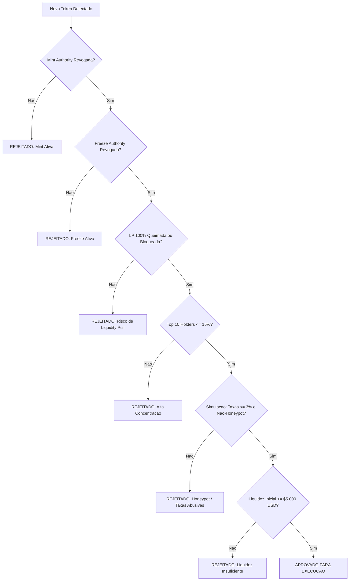

# SECURITY_RULES.md — Regras de Negócio e Mitigação de Riscos

> **Sistema**: Vertex-bot  
> **Prioridade Máxima**: Preservação de Capital sobre Maximização de Lucro  
> **Escopo**: Critérios inegociáveis de auditoria on-chain, dimensionamento financeiro e regras de saída automatizadas.

---

## 1. Princípio Fundamental de Segurança

O **Vertex-bot** opera sob o pressuposto de que **qualquer novo token é um rug pull ou honeypot em potencial até que passe por todos os testes formais de segurança**. Não há exceções manuais ou desativação de travas de proteção em produção.

---

## 2. Critérios Inegociáveis de Triagem On-Chain (Hard Gates)

Se um ativo falhar em **qualquer um** dos critérios abaixo, ele deve ser imediatamente classificado como `REJECTED`, descartado da fila de compra e gravado no banco de dados com a justificativa de reprovação.

### 2.1. Mint Authority (Autoridade de Cunhagem)
- **Regra**: O endereço da Mint Authority **deve ser nulo** (`None` / endereço desativado).
- **Justificativa**: Evita diluição ilimitada por parte dos criadores com criação de novos tokens após a adição de liquidez.

### 2.2. Freeze Authority (Autoridade de Congelamento)
- **Regra**: O endereço da Freeze Authority **deve ser nulo** (`None`).
- **Justificativa**: Garante que o criador não possa congelar contas associadas de holders (mecanismo clássico de honeypot em redes como Solana).

### 2.3. Status do Pool de Liquidez (LP Burn / Lock)
- **Regra**: Pelo menos **98% dos tokens de liquidez (LP tokens)** devem estar comprovadamente queimados (enviados para o endereço `11111111111111111111111111111111` / dead address) ou bloqueados em contratos de custódia auditados (ex: Streamflow, Uncx, Raydium Lock) por no mínimo 6 meses.
- **Justificativa**: Elimina o risco de "rug pull direto" via drenagem abrupta do par de liquidez.

### 2.4. Concentração de Fornecimento (Top Holders)
- **Regra**:
  - Excluindo o endereço do pool da DEX e endereços de queima, a soma dos **Top 10 holders** não pode ultrapassar **15% do supply circulante total**.
  - Nenhuma carteira individual privada pode deter mais de **3.5% do supply total**.
- **Justificativa**: Protege contra "slow rugs", onde insiders ou desenvolvedores despejam grandes blocos de tokens coordenadamente.

### 2.5. Simulação de Transação (Honeypot & Taxas)
- **Regra**:
  - Taxa de Compra (Buy Tax): $\le 3.0\%$.
  - Taxa de Venda (Sell Tax): $\le 3.0\%$.
  - A simulação de venda de 1 token deve ser bem-sucedida no RPC sem reverter (`is_honeypot = False`).
- **Justificativa**: Garante a viabilidade de liquidação do ativo a qualquer momento.

### 2.6. Limites de Liquidez Inicial
- **Liquidez Mínima**: $\ge \$5.000 \text{ USD}$. (Tokens com menos liquidez geram derrapagem destrutiva).
- **Liquidez Máxima Inicial**: $\le \$250.000 \text{ USD}$ (evita entrar em pools falsas ou armadilhas de bots institucionais).

---

## 3. Regras de Proteção Financeira e Execução

### 3.1. Limite Estrito de Slippage
- **Slippage Máximo Aceitável**: $1.5\%$ (tolerância limite de $2.0\%$ apenas em condições excepcionais de alta volatilidade).
- Se a cotação retornada pelo roteador da DEX indicar slippage superior a $2.0\%$, a ordem de compra **deve ser abortada**.

### 3.2. Dimensionamento de Posição (Position Sizing)
- **Teto por Operação**: Cada posição aberta não pode alocar mais de **$1.0\%$ a $2.0\%$ do saldo líquido total** da carteira.
- **Teto Nominal**: Configuração de `MAX_ALLOCATION_PER_TRADE_USD` (ex: máximo de $50 USD em fase de testes / paper trading).

---

## 4. Regras Matemáticas de Saída: Break-Even e Trailing Stop

Toda posição aprovada e preenchida entra imediatamente sob custódia da máquina de estados do módulo `RiskManager`, que executa duas estratégias complementares:

### 4.1. Estratégia de Break-Even (Venda Parcial de 50%)
- **Gatilho**: Quando o preço de mercado atual atingir o dobro do preço de entrada ($\text{Preço Atual} \ge \text{Preço de Entrada} \times 2.0$, ou seja, $+100\%$).
- **Ação**:
  $$\text{Quantidade a Vender} = \frac{\text{Quantidade Inicial}}{2}$$
- **Objetivo**: A venda de 50% dos tokens ao dobro do preço retorna exatamente $100\%$ do capital financeiro inicialmente alocado.
- **Efeito**: O restante da posição ($50\%$ dos tokens) torna-se uma posição de risco zero ("Moon Bag"), permitindo capturar ralis exponenciais sem qualquer chance de prejuízo no capital principal.
- **Marcação**: O flag `break_even_triggered` é gravado como `True`.

### 4.2. Estratégia de Trailing Stop Contínuo
O Trailing Stop rastreia o ponto mais alto de cotação registrado desde a entrada:

1. **Rastreamento de Máxima**:
   $$\text{highest\_price\_seen} = \max(\text{highest\_price\_seen}, \text{current\_price})$$

2. **Cálculo da Linha de Stop**:
   $$\text{trailing\_stop\_price} = \text{highest\_price\_seen} \times (1 - \text{trailing\_drop\_pct})$$
   *(Onde $\text{trailing\_drop\_pct}$ é padronizado em $0.12$ a $0.15$, correspondendo a $-12\%$ a $-15\%$ de recuo).*

3. **Gatilho de Liquidação Total**:
   - Se $\text{current\_price} \le \text{trailing\_stop\_price}$, o motor dispara uma ordem de venda a mercado de **$100\%$ dos tokens restantes** (`remaining_token_amount`).
   - Motivo registrado: `TRAILING_STOP_EXIT`.

### 4.3. Stop Loss Emergencial
- Se o ativo nunca atingir o patamar de Break-Even e o preço cair para $\le -20\%$ do preço de entrada (`entry_price * 0.80`), a posição é imediatamente liquidada por Stop Loss de Proteção para mitigar perdas maiores.

---

## 5. Circuit Breakers Globais (Desarme do Sistema)

| Disparador | Condição de Acionamento | Ação do Sistema |
| :--- | :--- | :--- |
| **Drawdown Diário** | Perda acumulada no dia $\ge 8\%$ da banca total | Desativação imediata de novas compras por 24h. Mantém apenas monitoramento e saída das posições abertas. |
| **Degradação de RPC** | Latência média $> 1500\text{ms}$ em 5 blocos consecutivos ou falhas de conexão | Pausa do Scanner e bloqueio de novas entradas até estabilização. |
| **Falha em Cascata** | 3 ordens consecutivas com erro de transação na DEX | Dispara alerta crítico, cancela fila e entra em modo de segurança (`SAFE_MODE`). |
